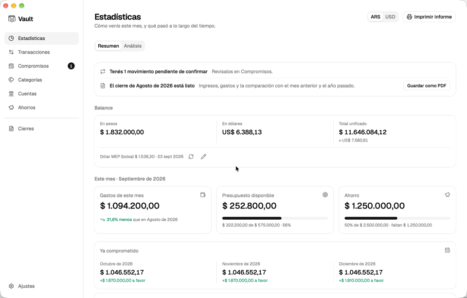
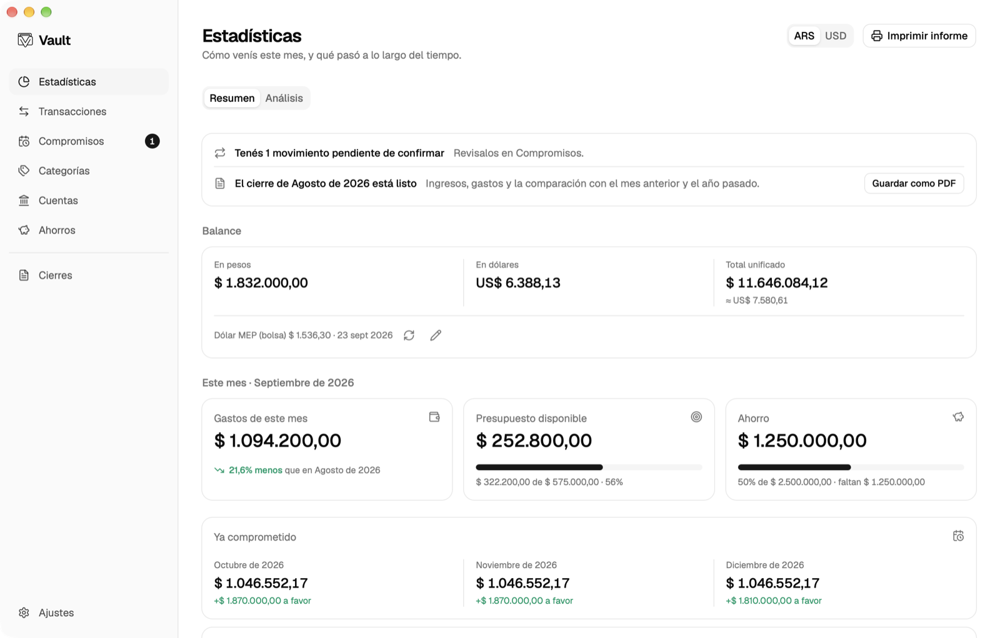
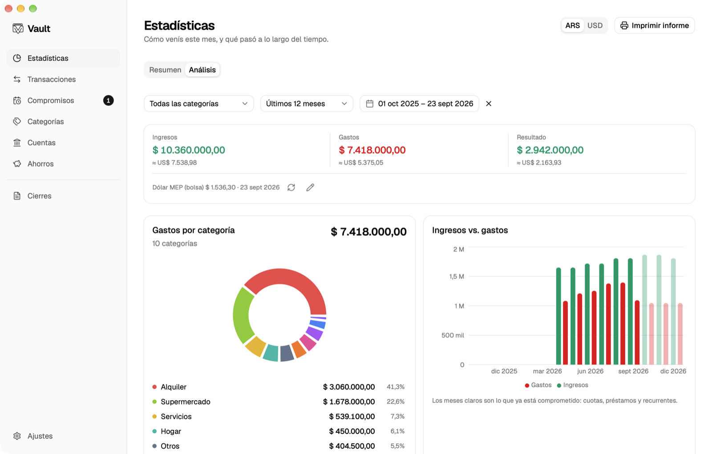
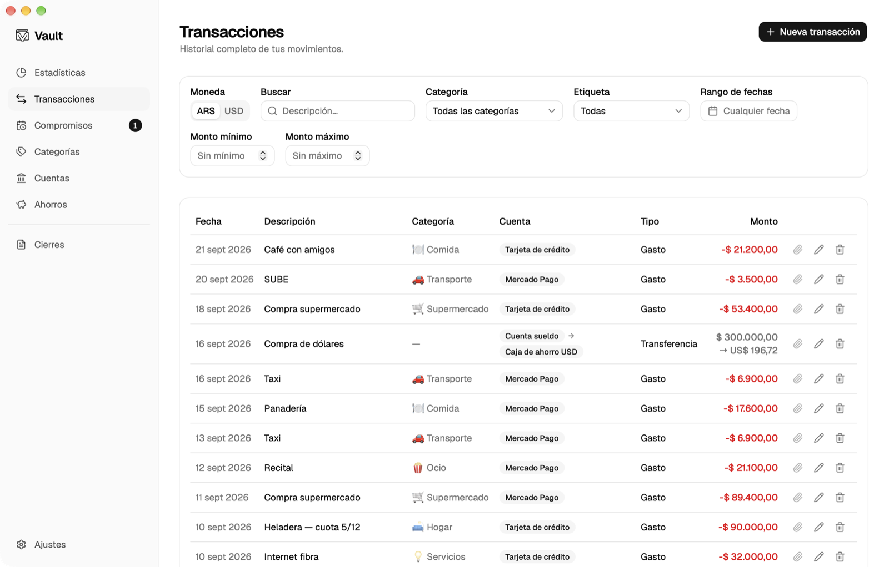
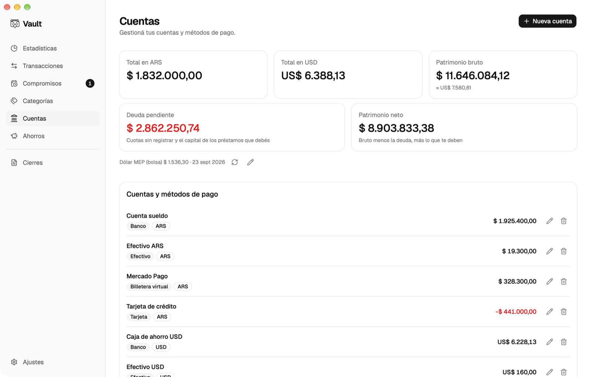
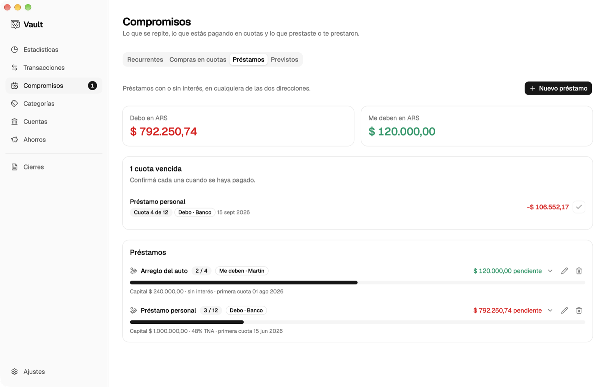
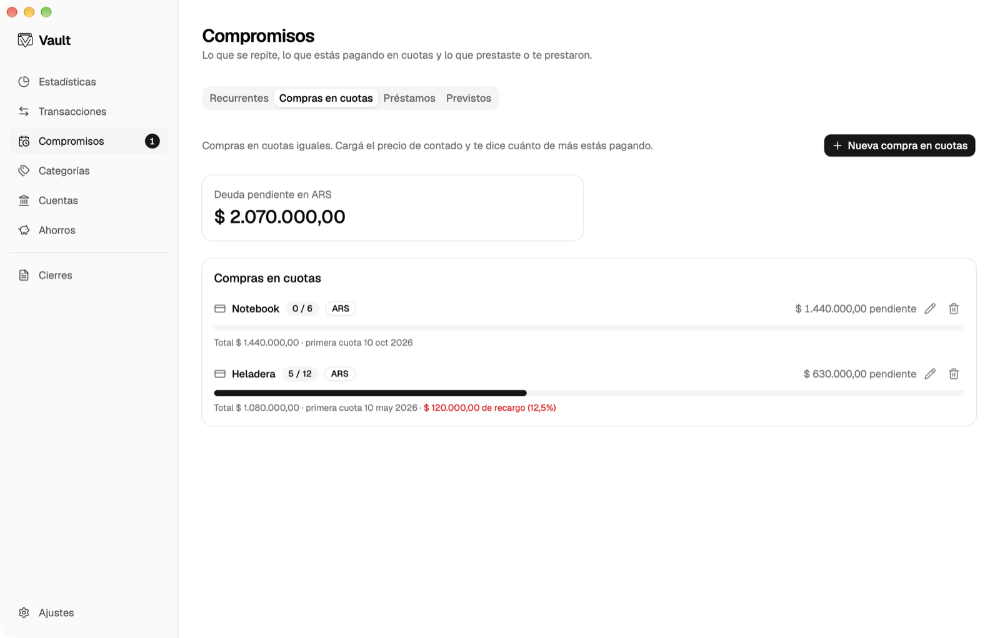

# Vault: finanzas personales local-first

A desktop app for personal finances, built for how money works in Argentina:
pesos and dollars side by side, purchases in _cuotas_, loans, and the MEP rate
of the day. Everything lives in a SQLite file on your own computer — no
account, no server, no subscription.

**[Download for macOS or Windows →](https://github.com/FerminLasarte/vault/releases/latest)**



The interface is in Spanish (Argentina). Every figure in these images is made up.

## Features

- **Pesos and dollars together.** Every account has a currency; balances, net
  worth and reports convert at the day's MEP rate, fetched automatically and
  editable by hand. Buying dollars is a transfer with the amount on each side.
- **Statistics.** This month against the last one, spending by category and
  against budget, income against expenses, and what the coming months already
  have committed.
- **Commitments.** Recurring movements, purchases in instalments (with the
  surcharge over the cash price), loans in either direction with or without
  interest, and expected one-off movements. Nothing is recorded until you
  confirm it.
- **Budgets and savings goals,** with the pace you are saving at and the date
  you would reach each goal.
- **Monthly close.** A summary of each finished month against the previous one
  and the same month a year earlier, exportable to PDF.
- **Import and export.** Bank statements in CSV or XLSX with a column mapping
  that is remembered per bank, CSV export, and rules that assign the category
  from the description.
- **Attachments, tags, search and filters** on every transaction.
- **Backups** to any folder, with a reminder when the last one is old.
- **Updates itself** from the signed packages on this repository's releases.

## Screenshots

|                                               |                                              |
| --------------------------------------------- | -------------------------------------------- |
|  |         |
|  |         |
|                |  |

## Installing

Download the file for your system from the
[latest release](https://github.com/FerminLasarte/vault/releases/latest):

| System                        | File                            |
| ----------------------------- | ------------------------------- |
| macOS (Apple Silicon & Intel) | `Vault_<version>_universal.dmg` |
| Windows                       | `Vault_<version>_x64-setup.exe` |

The installers are not signed with an Apple or Microsoft developer
certificate, so the system warns the first time:

- **macOS:** open the app once, then go to _System Settings › Privacy &
  Security_ and choose _Open Anyway_.
- **Windows:** on the SmartScreen notice, choose _More info › Run anyway_.

After that the app keeps itself up to date: every copy checks this repository
for a new version, and only installs updates signed with the project's key.

## Privacy

Your finances never leave your computer. The app makes exactly two kinds of
network request: dollar rates — today's from [DolarApi](https://dolarapi.com)
and past ones from [ArgentinaDatos](https://argentinadatos.com) — and the
update check against this repository's releases. Neither sends anything about
you. There is no analytics, telemetry or account of any kind. The database is a
plain SQLite file whose location is shown in _Ajustes_; back it up, move it, or
open it with any SQLite tool.

## How it was built

Vault is designed and directed by [Fermín Lasarte](https://github.com/FerminLasarte)
and written together with [Claude Code](https://claude.com/claude-code), an AI
coding agent — the co-authored commits in the history are that collaboration.
What keeps the result trustworthy is the process around it rather than who
typed each line:

- Domain logic (balances, instalments, loans, projections, reports) is pure
  TypeScript in `src/lib`, tested on its own, with the UI only composing it.
- Every logic bug gets a failing test before its fix.
- Continuous integration runs type checking, lint, formatting and the test
  suite on the frontend, and `cargo fmt` and `clippy` on the Rust side.
- The app went through documented review passes — [`AUDIT.md`](AUDIT.md),
  [`POLISH.md`](POLISH.md) and [`REVIEW.md`](REVIEW.md) — each finding tracked
  to the pull request that fixed it.

## Tech stack

- **Shell / runtime**: [Tauri v2](https://tauri.app/) (Rust backend, native webview)
- **Frontend**: React 19 + TypeScript, bundled with [Vite](https://vitejs.dev/)
- **Styling**: Tailwind CSS v4
- **UI components**: [shadcn/ui](https://ui.shadcn.com/)
- **Local data**: SQLite via `tauri-plugin-sql`

## Prerequisites

- [Node.js](https://nodejs.org/) 18+ and npm
- [Rust](https://www.rust-lang.org/tools/install) (stable toolchain)
- Tauri's platform-specific system dependencies — follow the [Tauri prerequisites guide](https://tauri.app/start/prerequisites/) for your OS

## Getting started

Install dependencies:

```bash
npm install
```

Run the app in development mode (starts Vite and opens the native window with hot reload):

```bash
npm run tauri dev
```

## Other commands

| Command                 | Description                                                             |
| ----------------------- | ----------------------------------------------------------------------- |
| `npm run dev`           | Run only the Vite dev server (frontend in the browser, no native shell) |
| `npm run tauri dev`     | Run the full desktop app in development mode                            |
| `npm run tauri build`   | Build the production desktop app bundle                                 |
| `npm run build`         | Type-check and build the frontend only                                  |
| `npm run test`          | Run the test suite (Vitest)                                             |
| `npm run test:coverage` | Run the suite and report coverage                                       |
| `npm run typecheck`     | Type-check without emitting output                                      |
| `npm run lint`          | Lint with ESLint (`lint:fix` applies the automatic fixes)               |
| `npm run format`        | Format with Prettier (`format:check` verifies without writing)          |

## Continuous integration

Every push and pull request runs `.github/workflows/ci.yml`: type check, lint,
format check and the test suite for the frontend, plus `cargo fmt` and
`cargo clippy` for the Rust side.

## Releasing

Tauri cannot cross-compile, so the Windows installer is built on a Windows
runner by `.github/workflows/release.yml`. Pushing a `v*` tag is what triggers
it; a manual run builds the same installers but attaches them to the run as
artifacts instead of publishing anything.

Write the notes for the release into `RELEASE_NOTES.md` first. The workflow
reads that file at build time and the action copies it into `latest.json`, which
is what an installed copy shows in Ajustes — notes added to the release page
after the build never reach anyone who already has the app.

Then create the draft release, from the same file, **before** pushing the tag:

```bash
gh release create vX.Y.Z --draft --title "Vault vX.Y.Z" --notes-file RELEASE_NOTES.md
```

Skipping the draft fails in a way the error does not explain. The repository
keeps Actions on read-only by default, and the workflow raises itself only as
far as `contents: write` — enough to upload assets to a release that exists, not
enough to create one, so a run with no draft waiting for it dies at the last
step with `Resource not accessible by integration`. The action never rewrites
the body of a draft, so the notes put there survive the run.

Then:

1. `git tag vX.Y.Z && git push origin vX.Y.Z`
2. Wait for both jobs (~8 minutes).
3. Check the assets: both installers, `latest.json`, and a `.sig` beside every
   updater package. A missing `.sig` means the signing key never reached the
   build, and updates would be refused by every installed copy.
4. Install the build and confirm it runs.
5. Publish the draft. Until then the updater endpoint 404s and nobody, not even
   an installed copy, can see the new version.

Bumping the version means `package.json` and `src-tauri/Cargo.toml` (then run
`cargo check` in `src-tauri` so `Cargo.lock` follows). `tauri.conf.json` reads it
from `package.json`, and `src/version.test.ts` fails if the three disagree. The
tag does not set it; the one baked into the installers comes from these files.

A manual run builds the same installers and hands them back as run artifacts,
without touching any release — which makes it the way to try a change to this
workflow before a real release depends on it.

### Updater signing

`TAURI_SIGNING_PRIVATE_KEY` is a repository secret and its public half lives in
`src-tauri/tauri.conf.json`. The public half is baked into every copy that ships,
and it cannot be changed remotely afterwards — losing the private key means
losing the ability to update any copy already installed, permanently.

## Project structure

- `src/components` — React components (`src/components/ui` holds shadcn-generated primitives)
- `src/lib` — shared utilities
- `src/hooks` — custom React hooks
- `src/context` — React context providers
- `src/db` — local SQLite access layer (queries, schema, migrations)
- `src-tauri` — Rust backend, Tauri commands, and native integrations

## Recommended IDE Setup

- [VS Code](https://code.visualstudio.com/) + [Tauri](https://marketplace.visualstudio.com/items?itemName=tauri-apps.tauri-vscode) + [rust-analyzer](https://marketplace.visualstudio.com/items?itemName=rust-lang.rust-analyzer)
